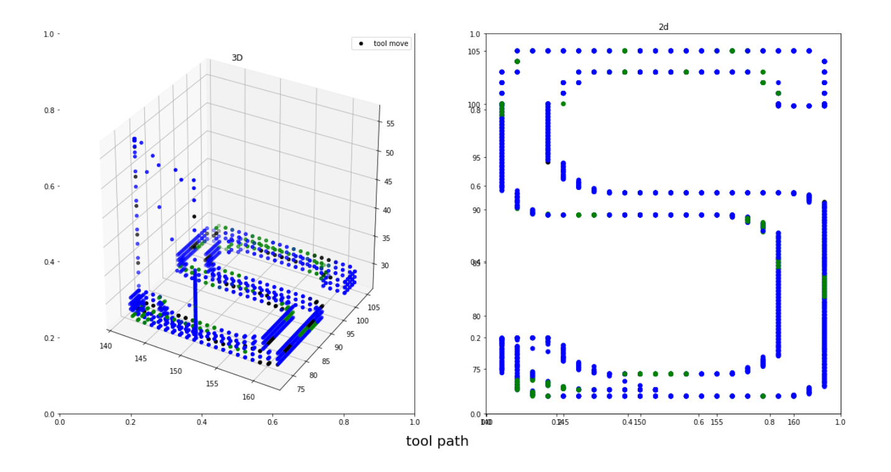
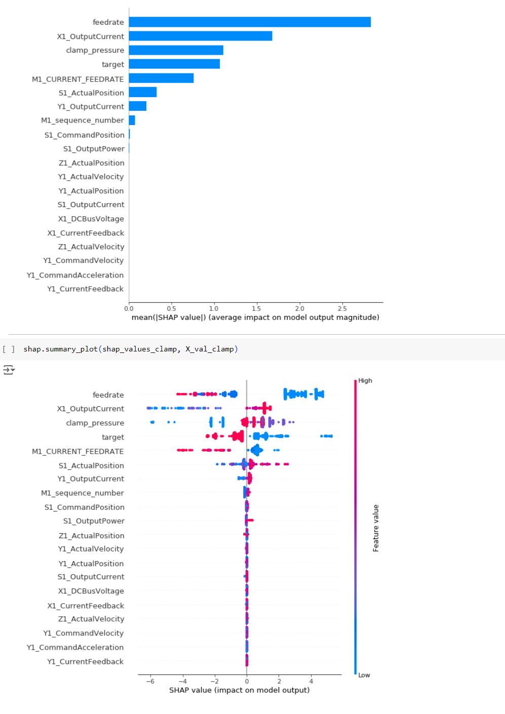
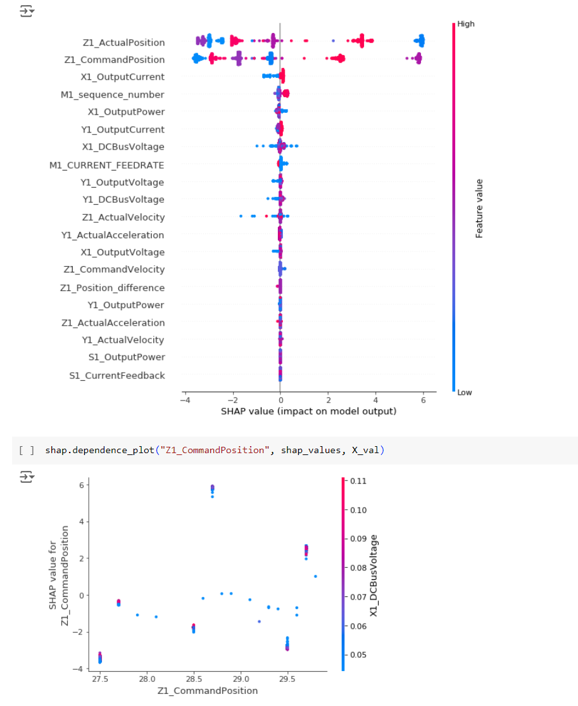

# tool_wear_detector

## Predicting Tool Wear on CNC Machines

### Project Overview
This project aims to build a model to predict tool wear on CNC (Computer Numerical Control) machines. Predicting tool wear helps in maintaining the machines and ensuring they operate efficiently without unexpected problems.

### Introduction
The primary objective of this project is to develop a machine learning model that can estimate the wear of tools used in CNC machines. This estimation is based on data collected from various sensors and operational parameters during the machine's operation.

### Objective
By predicting tool wear accurately, we can preemptively address maintenance needs, reduce machine downtime, and improve overall productivity. This proactive approach helps in extending the lifespan of tools and maintaining high-quality production standards.

### Dataset
The dataset used in this project is sourced from Kaggle, containing detailed records of CNC machine operations. It includes crucial metrics like positions, velocities, and accelerations in different axes, along with the target variable indicating whether a tool is worn or unworn.

### Conclusion
With the development of this predictive model, we aim to provide a robust solution for tool wear detection in CNC machines. This will significantly contribute to optimizing maintenance schedules, improving machine performance, and ensuring uninterrupted manufacturing processes.

For more information, please visit the project's [GitHub repository](https://github.com/yourusername/tool_wear_detector).

### Graphics

